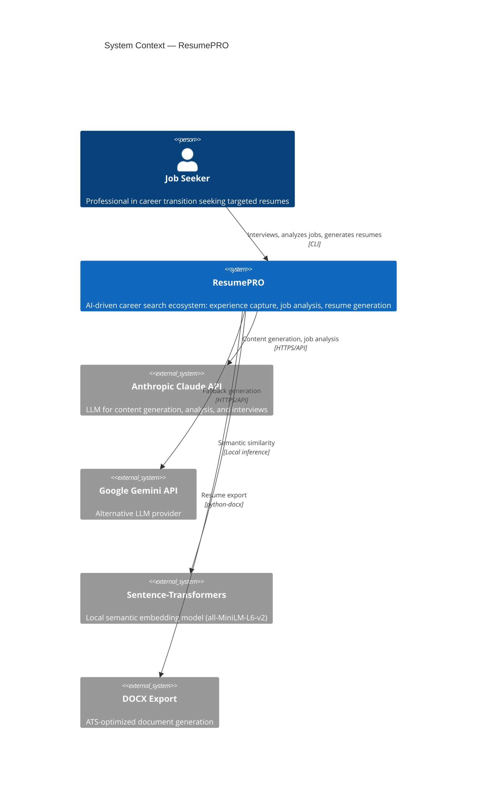
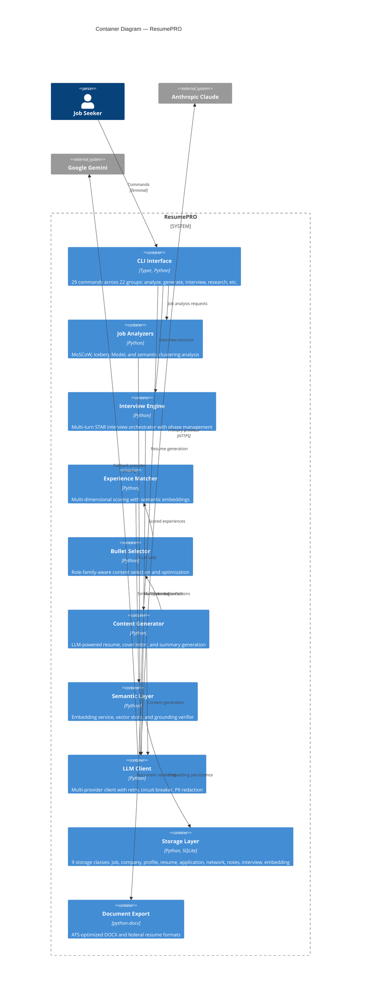
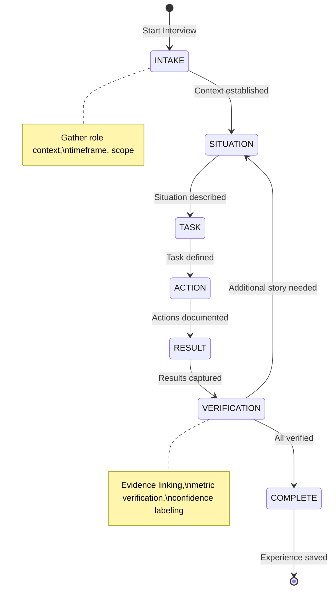

# System Architecture

> Technical architecture documentation for ResumePRO.
> Follows the [C4 Model](https://c4model.com/) with Mermaid.js diagrams.

---

## 1. System Context (C4 Level 1)

How ResumePRO fits into the broader ecosystem and interacts with users and external systems.



---

## 2. Container Architecture (C4 Level 2)

The logical components that compose the system.



---

## 3. Key Design Decisions

| Decision | Choice | Why | Alternatives Considered |
|----------|--------|-----|------------------------|
| **Architecture** | Local-first CLI | User controls all data and API keys; no cloud dependency for storage | Web app (requires hosting), Desktop GUI (slower iteration) |
| **LLM Strategy** | Cloud API with offline fallback | Quality-critical content needs API-grade models; offline mode enables use without API keys | Local models only (insufficient quality for metric preservation), API only (no offline capability) |
| **Experience Format** | STAR with evidence linking | Structured format enables systematic matching; evidence links ensure truthfulness | Free-form narratives (hard to match), keyword lists (lose context) |
| **Job Analysis** | Three-framework approach | MoSCoW captures priority, Iceberg captures hidden needs, clustering groups themes | Single-framework (misses nuance), keyword-only (too shallow) |
| **Matching Algorithm** | Multi-dimensional semantic scoring | Captures relevance across skills, competencies, recency, and measurable impact | Keyword matching (misses semantic similarity), LLM-only ranking (expensive, non-deterministic) |
| **Storage** | SQLite with abstract base class | Zero-config, portable, sufficient for single-user; ABC enables future backend swaps | PostgreSQL (overkill), JSON files (no query capability), cloud DB (breaks local-first) |
| **Multi-Provider LLM** | Anthropic primary, Gemini fallback | Provider diversity prevents vendor lock-in; circuit breaker handles outages | Single provider (fragile), local models (quality gap) |
| **PII Protection** | Three-layer pipeline | Logging filter, LLM call redaction, and privacy CLI commands cover different attack surfaces | Single-layer (gaps in coverage), external service (breaks local-first) |

---

## 4. Data Flow

The primary use case: analyzing a job posting and generating a targeted resume.

```mermaid
flowchart TD
    A[Job Posting Text] --> B[Job Posting Analyzer]
    B --> C{Analysis Frameworks}
    C --> D[MoSCoW Requirements]
    C --> E[Iceberg Model Analysis]
    C --> F[Semantic Clustering]

    D & E & F --> G[Unified Job Analysis]

    H[Experience Library] --> I[Experience Scorer]
    G --> I

    I --> J[Multi-Dimensional Scoring]
    J --> K[Ranked Experiences]

    K --> L[Bullet Selector]
    G --> L
    M[Role-Family Bullet Library] --> L

    L --> N[Selected Bullets per Section]

    N --> O[Content Generator]
    G --> O
    O --> P[LLM: Summary & Tailoring]

    P --> Q[Resume Assembler]
    Q --> R[DOCX Exporter]
    R --> S[ATS-Optimized Resume]

    style A fill:#2d5016
    style S fill:#1a4480
    style B fill:#3d3d3d
    style I fill:#3d3d3d
    style L fill:#3d3d3d
    style O fill:#3d3d3d
    style Q fill:#3d3d3d
```



---

## 5. Interview Flow

The STAR interview process for experience capture.



---

## 6. Security Posture

| Concern | Approach |
|---------|----------|
| **Data Locality** | All user data stored locally; no cloud storage of personal information |
| **API Key Management** | Environment variables only; never stored in code or committed to version control |
| **PII in Logs** | Dedicated PII scrub filter in the logging pipeline removes sensitive patterns before any log output |
| **PII in LLM Calls** | Optional PII redactor strips personal identifiers before sending content to cloud LLM providers |
| **Evidence Integrity** | Grounding verifier cross-references claims against source documents; confidence levels explicitly labeled |
| **Input Validation** | Pydantic schema enforcement on all data contracts; type-safe throughout the pipeline |
| **Privacy Controls** | CLI privacy commands: scan (detect PII), status (view settings), wipe (secure data deletion with confirmation) |

---

## 7. Technology Stack

| Layer | Technology | Role |
|-------|-----------|------|
| **Language** | Python 3.12+ | Core implementation |
| **CLI** | Typer | Command-line interface with 29 commands |
| **LLM (Primary)** | Anthropic Claude (Sonnet, Opus) | Job analysis, content generation, interviews |
| **LLM (Fallback)** | Google Gemini | Alternative provider with automatic failover |
| **Embeddings** | sentence-transformers (all-MiniLM-L6-v2) | Semantic similarity for experience matching |
| **Data Validation** | Pydantic v2 | Schema enforcement across all data models |
| **Storage** | SQLite | Structured data persistence (9 storage classes) |
| **Document Export** | python-docx | ATS-optimized DOCX generation |
| **NLP** | spaCy, NLTK | Text processing, entity extraction |
| **Testing** | pytest (2,534 tests) | Unit, integration, and regression coverage |
| **Prompt Management** | YAML templates with caching | Structured prompt loading and versioning |

---

## 8. Module Architecture

```
ResumePRO (25+ packages, 138 source files)
├── analyzers/          Job posting analysis (MoSCoW, Iceberg, Clustering)
├── cli/                29 CLI commands (Typer-based)
├── generation/         Resume, cover letter, summary, federal resume
├── ingestion/          Military records parsing, experience normalization
├── interview/          STAR interview orchestrator, session management
├── llm/                Multi-provider LLM client (Anthropic + Gemini)
├── matching/           Experience scoring, semantic similarity
├── research/           Company profiling, salary analysis
├── roles/              Role family management (14 families)
├── schemas/            Pydantic data contracts (v1)
├── selection/          Bullet selection and optimization
├── semantic/           Embedding service, vector store, grounding
├── storage/            9 SQLite storage classes (BaseStorage ABC)
└── utils/              Logging, retry, PII redaction, prompt loading
```

---

*This document describes the system architecture without exposing implementation specifics.*
*Copyright 2026 TJ Neary. All Rights Reserved.*
