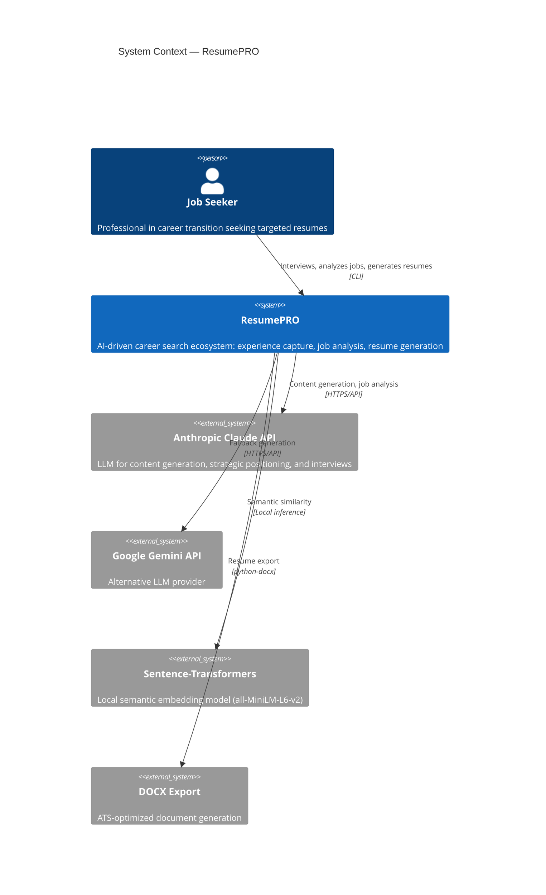
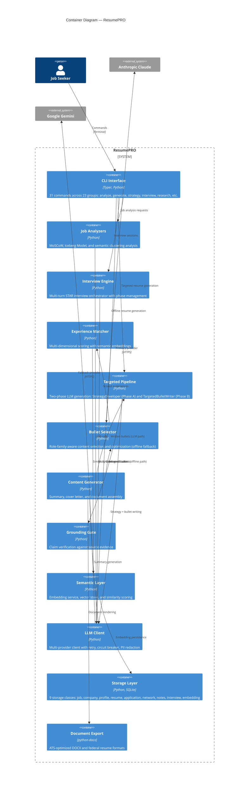
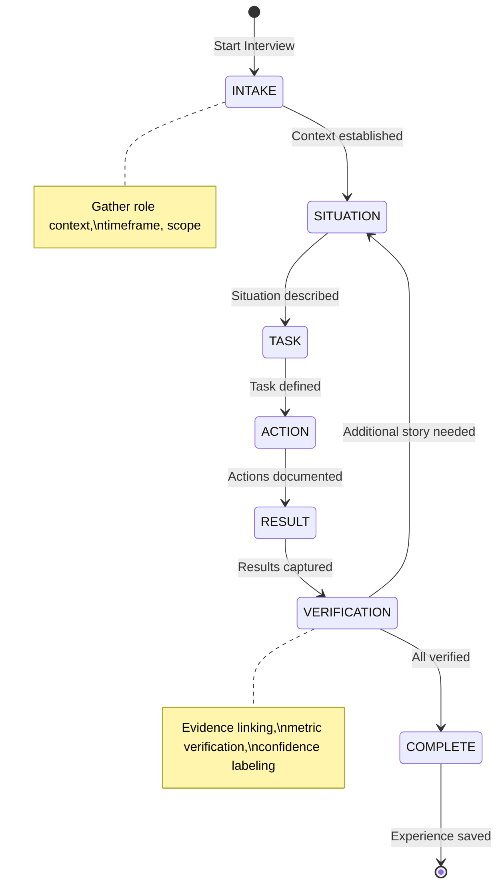

# System Architecture

> Technical architecture documentation for ResumePRO.
> Follows the [C4 Model](https://c4model.com/) with Mermaid.js diagrams.

---

## 1. System Context (C4 Level 1)

How ResumePRO fits into the broader ecosystem and interacts with users and external systems.



---

## 2. Container Architecture (C4 Level 2)

The logical components that compose the system.



---

## 3. Key Design Decisions

| Decision | Choice | Why | Alternatives Considered |
|----------|--------|-----|------------------------|
| **Architecture** | Local-first CLI | User controls all data and API keys; no cloud dependency for storage | Web app (requires hosting), Desktop GUI (slower iteration) |
| **Resume Pipeline** | Two-phase LLM with offline fallback | Phase A (strategy) enables human review before content generation; Phase B (writing) produces custom bullets grounded in real data; offline mode works without API keys | Single-phase generation (no reviewable strategy), LLM-only (no offline capability), mechanical-only (no strategic positioning) |
| **LLM Strategy** | Cloud API with offline fallback | Quality-critical content needs API-grade models; offline mode enables use without API keys | Local models only (insufficient quality for metric preservation), API only (no offline capability) |
| **Experience Format** | STAR with evidence linking | Structured format enables systematic matching; evidence links ensure truthfulness | Free-form narratives (hard to match), keyword lists (lose context) |
| **Job Analysis** | Three-framework approach | MoSCoW captures priority, Iceberg captures hidden needs, clustering groups themes | Single-framework (misses nuance), keyword-only (too shallow) |
| **Matching Algorithm** | Six-dimensional semantic scoring | Captures relevance across keyword match, competency alignment, recency, metric strength, semantic similarity, and personalized assessment signals | Keyword matching (misses semantic similarity), LLM-only ranking (expensive, non-deterministic) |
| **Data Standardization** | Automatic schema normalization | Canonical format enforcement across all experience entries regardless of input source; eliminates schema drift | Manual enforcement (error-prone), multiple accepted formats (fragile downstream) |
| **Storage** | SQLite with abstract base class | Zero-config, portable, sufficient for single-user; ABC enables future backend swaps | PostgreSQL (overkill), JSON files (no query capability), cloud DB (breaks local-first) |
| **Multi-Provider LLM** | Anthropic primary, Gemini fallback | Provider diversity prevents vendor lock-in; circuit breaker handles outages | Single provider (fragile), local models (quality gap) |
| **PII Protection** | Three-layer pipeline | Logging filter, LLM call redaction, and privacy CLI commands cover different attack surfaces | Single-layer (gaps in coverage), external service (breaks local-first) |

---

## 4. Data Flow — Targeted Pipeline

The primary use case: analyzing a job posting and generating a strategically targeted resume.

```mermaid
flowchart TD
    A[Job Posting Text] --> B[Job Posting Analyzer]
    B --> C{Analysis Frameworks}
    C --> D[MoSCoW Requirements]
    C --> E[Iceberg Model Analysis]
    C --> F[Semantic Clustering]

    D & E & F --> G[Unified Job Analysis]

    G --> H{LLM Available?}

    H -- Yes --> I[Phase A: Strategy Developer]
    H[Experience Library] --> I
    I --> J[Positioning Strategy]
    J --> K{Human Review}
    K -- Approved --> L[Phase B: Targeted Bullet Writer]
    L --> M[Grounding Gate]
    M --> N[Verified Custom Bullets]

    H -- No --> O[Experience Scorer]
    O --> P[Bullet Selector]
    P --> Q[Enhanced Bullets]

    N --> R[Resume Assembler]
    Q --> R
    R --> S[DOCX Exporter]
    S --> T[ATS-Optimized Resume]

    style A fill:#2d5016
    style T fill:#1a4480
    style I fill:#4a1a6b
    style L fill:#4a1a6b
    style J fill:#6b3a1a
    style M fill:#3d3d3d
    style O fill:#3d3d3d
    style P fill:#3d3d3d
    style R fill:#3d3d3d
```



---

## 5. Data Flow — Mechanical Pipeline (Offline Fallback)

The offline path: keyword-based scoring and pre-generated bullet selection without LLM calls.

```mermaid
flowchart TD
    A[Job Posting Text] --> B[Offline Job Analyzer]
    B --> C[Keyword Extraction]
    B --> D[Requirement Classification]

    C & D --> G[Job Analysis]

    H[Experience Library] --> I[Experience Scorer]
    G --> I

    I --> J[Multi-Dimensional Scoring]
    J --> K[Ranked Experiences]

    K --> L[Bullet Selector]
    G --> L
    M[Role-Family Bullet Library] --> L

    L --> N[Selected Bullets per Section]

    N --> O[Bullet Enhancer]
    O --> P[Resume Assembler]
    P --> Q[DOCX Exporter]
    Q --> R[ATS-Optimized Resume]

    style A fill:#2d5016
    style R fill:#1a4480
    style B fill:#3d3d3d
    style I fill:#3d3d3d
    style L fill:#3d3d3d
    style O fill:#3d3d3d
    style P fill:#3d3d3d
```



---

## 6. Interview Flow

The STAR interview process for experience capture.



---

## 7. Security Posture

| Concern | Approach |
|---------|----------|
| **Data Locality** | All user data stored locally; no cloud storage of personal information |
| **API Key Management** | Environment variables only; never stored in code or committed to version control |
| **PII in Logs** | Dedicated PII scrub filter in the logging pipeline removes sensitive patterns before any log output |
| **PII in LLM Calls** | Optional PII redactor strips personal identifiers before sending content to cloud LLM providers |
| **Evidence Integrity** | Grounding verifier cross-references claims against source documents; confidence levels explicitly labeled |
| **Input Validation** | Pydantic schema enforcement on all data contracts; type-safe throughout the pipeline |
| **Privacy Controls** | CLI privacy commands: scan (detect PII), status (view settings), wipe (secure data deletion with confirmation) |
| **Pre-Commit Security** | 12-phase security scanner: secrets, YAML values, .env scanning, PII, private references, sensitive files, database files, code patterns, private assets, commercial markers, compliance checks |

---

## 8. Technology Stack

| Layer | Technology | Role |
|-------|-----------|------|
| **Language** | Python 3.12+ | Core implementation |
| **CLI** | Typer | Command-line interface with 31 commands |
| **LLM (Primary)** | Anthropic Claude (Sonnet, Opus) | Job analysis, strategic positioning, content generation, interviews |
| **LLM (Fallback)** | Google Gemini | Alternative provider with automatic failover |
| **Embeddings** | sentence-transformers (all-MiniLM-L6-v2) | Semantic similarity for experience matching |
| **Data Validation** | Pydantic v2 | Schema enforcement across all data models |
| **Storage** | SQLite | Structured data persistence (9 storage classes) |
| **Document Export** | python-docx | ATS-optimized DOCX generation |
| **NLP** | spaCy, NLTK | Text processing, entity extraction |
| **Prompt Management** | YAML templates with caching | 18 structured prompt templates for LLM interactions |
| **Testing** | pytest (2,656 tests) | Unit, integration, and regression coverage |

---

## 9. Module Architecture

```
ResumePRO (25+ packages, 153 source files)
├── analyzers/          Job posting analysis (MoSCoW, Iceberg, Clustering)
├── cli/                31 CLI commands (Typer-based, 23 groups + 8 standalone)
├── generation/         22 files: targeted pipeline, resume assembly, cover letter, summary, federal resume
│   ├── targeted_writer.py      Two-phase LLM generation orchestrator
│   ├── positioning_strategy.py Strategy data models (PositioningStrategy, ExperienceDirective)
│   ├── experience_digest.py    Compact experience summaries for Phase A
│   └── grounding_gate.py       Claim verification wrapper
├── ingestion/          Military records parsing, experience normalization, data standardization
├── interview/          STAR interview orchestrator, session management
├── llm/                Multi-provider LLM client (Anthropic + Gemini)
├── matching/           Experience scoring, semantic similarity
├── research/           Company profiling, salary analysis, market intelligence
├── services/           Role loading, category mapping, assessment integration
├── roles/              Role family management (16 families)
├── schemas/            Pydantic data contracts (v1)
├── selection/          Bullet selection and optimization (offline path)
├── semantic/           Embedding service, vector store, grounding
├── storage/            9 SQLite storage classes (BaseStorage ABC)
└── utils/              Logging, retry, PII redaction, prompt loading
```

---

*This document describes the system architecture without exposing implementation specifics.*
*Copyright 2026 TJ Neary. All Rights Reserved.*
